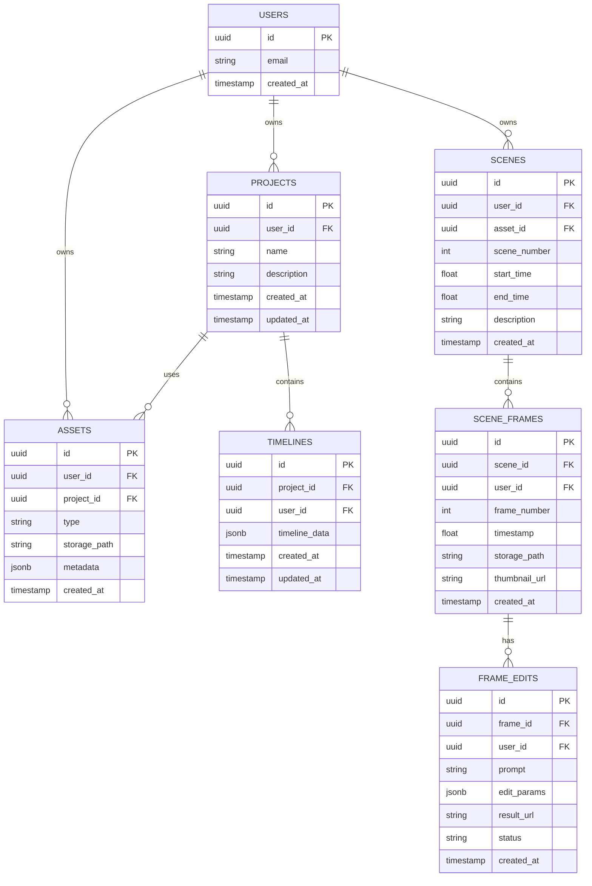

# Non-Linear Video Editor - Architecture Documentation

## Table of Contents
1. [System Overview](#system-overview)
2. [High-Level Architecture](#high-level-architecture)
3. [Frontend Architecture](#frontend-architecture)
4. [Backend Architecture](#backend-architecture)
5. [Database Schema](#database-schema)
6. [External Services Integration](#external-services-integration)
7. [State Management](#state-management)
8. [Data Flow](#data-flow)
9. [Security Architecture](#security-architecture)
10. [Technology Stack](#technology-stack)

---

## System Overview

The Non-Linear Video Editor is a modern, web-based video editing application built with Next.js 15, React 19, and TypeScript. It provides AI-powered video editing capabilities with integration to Google's Gemini and Veo models, audio generation through Suno and ElevenLabs, and secure asset management via Supabase.

### Key Features
- Multi-track timeline editing with drag-drop support
- AI-powered video generation (Google Veo 3.1)
- AI chat assistant (Gemini 2.5 Flash)
- Keyframe extraction and editing
- Scene detection and audio splitting
- Audio generation (Suno, ElevenLabs)
- Undo/redo with 50-action history
- Real-time preview and playback
- Secure asset storage with signed URLs

---

## High-Level Architecture


---

## Frontend Architecture

### Component Hierarchy


### Key Frontend Files
- **components/BrowserEditorClient.tsx** - Main editor orchestrator, handles timeline state
- **components/HorizontalTimeline.tsx** - Timeline UI with drag-drop, trimming, scrubbing
- **components/PreviewPlayer.tsx** - Multi-track video playback with RAF-based sync
- **components/KeyframeEditorShell.tsx** - Keyframe extraction and AI-powered editing
- **components/EditorHeader.tsx** - Navigation, project switcher
- **components/ChatInterface.tsx** - AI chat with Gemini integration

---

## Backend Architecture

### API Routes (15 Total)


### API Route Responsibilities

#### Video Generation
- **POST /api/video/generate** - Generate video using Google Veo 3.1
- **GET /api/video/status** - Check video generation status
- **POST /api/video/split-scenes** - Detect scenes using Video Intelligence
- **POST /api/video/split-audio** - Extract and analyze audio tracks

#### AI Features
- **POST /api/chat** - Chat with Gemini 2.5 Flash for editing assistance
- **POST /api/edit-frame** - AI-powered frame editing (mask-based editing)

#### Audio Generation
- **POST /api/audio/suno** - Generate music with Suno
- **POST /api/audio/elevenlabs** - Generate voiceover with ElevenLabs TTS

#### Project & Asset Management
- **POST /api/projects/create** - Create new editing project
- **GET /api/projects** - List user's projects
- **PUT /api/projects/:id** - Update project metadata
- **POST /api/assets/upload** - Upload video/audio/image assets
- **POST /api/assets/sign-url** - Generate signed URLs for secure access
- **GET /api/assets** - List project assets

#### Utility
- **POST /api/log** - Client-side logging to Axiom
- **GET /api/health** - Health check endpoint

---

## Database Schema



### Database Tables

1. **projects** - User editing projects
2. **timelines** - Timeline state (tracks, clips, effects)
3. **assets** - Uploaded media files (video, audio, images)
4. **scenes** - Detected scenes from videos
5. **scene_frames** - Individual frames extracted from scenes
6. **frame_edits** - AI edits applied to frames
7. **users** - Authenticated users (managed by Supabase Auth)

### Row-Level Security (RLS)
All tables implement RLS policies:
- Users can only access their own data
- Policies enforce `user_id = auth.uid()`
- Service role bypasses RLS for server operations

---

## External Services Integration

### Google AI Services

```mermaid
graph TB
    subgraph "Google Cloud Platform"
        Gemini[Gemini 2.5 Flash]
        Veo[Veo 3.1 Video Generation]
        VideoIntel[Video Intelligence API]
        Imagen[Imagen 3 - Image Generation]
    end

    subgraph "API Integration Layer"
        GeminiClient[lib/gemini.ts]
        VeoClient[lib/veo.ts]
        VideoIntelClient[lib/video-intelligence.ts]
    end

    subgraph "API Routes"
        ChatAPI[/api/chat]
        VideoGenAPI[/api/video/generate]
        VideoStatusAPI[/api/video/status]
        SplitScenesAPI[/api/video/split-scenes]
        EditFrameAPI[/api/edit-frame]
    end

    ChatAPI --> GeminiClient
    VideoGenAPI --> VeoClient
    VideoStatusAPI --> VeoClient
    SplitScenesAPI --> VideoIntelClient
    EditFrameAPI --> GeminiClient

    GeminiClient --> Gemini
    VeoClient --> Veo
    VideoIntelClient --> VideoIntel
```

### Audio Services

```mermaid
graph TB
    subgraph "Audio Providers"
        Suno[Suno - Music Generation]
        ElevenLabs[ElevenLabs - Text-to-Speech]
    end

    subgraph "API Integration"
        SunoAPI[/api/audio/suno]
        ElevenAPI[/api/audio/elevenlabs]
    end

    subgraph "Client Libraries"
        HTTPClient[fetch/axios]
    end

    SunoAPI --> HTTPClient
    ElevenAPI --> HTTPClient
    HTTPClient --> Suno
    HTTPClient --> ElevenLabs
```

### Service Configuration

| Service | Purpose | Authentication | Limits |
|---------|---------|----------------|--------|
| Google Gemini 2.5 Flash | Chat, analysis, image editing | API Key | Rate limited |
| Google Veo 3.1 | Video generation | Service Account | Quota-based |
| Video Intelligence | Scene detection | Service Account | Quota-based |
| Suno | Music generation | API Key | Credit-based |
| ElevenLabs | Text-to-speech | API Key | Character-based |
| Supabase | Database, auth, storage | Service key | Connection pool |
| Axiom | Logging & monitoring | API Token | Event-based |

---

## State Management

### Zustand Store Architecture

```mermaid
graph TB
    subgraph "Zustand Store - state/editorStore.ts"
        State[Editor State]
        Actions[50+ Actions]
        Middleware[Immer Middleware]
        History[Undo/Redo History]
    end

    subgraph "State Shape"
        Timeline[timeline: TimelineState]
        Clips[clips: Map<id, Clip>]
        Tracks[tracks: Track[]]
        Playback[playbackState]
        Selection[selectedClips]
        UI[uiState]
    end

    subgraph "Key Actions"
        AddClip[addClip]
        MoveClip[moveClip]
        TrimClip[trimClip]
        DeleteClip[deleteClip]
        UndoRedo[undo/redo]
        SaveTimeline[saveToSupabase]
    end

    subgraph "Persistence"
        LocalStorage[LocalStorage Cache]
        Supabase[Supabase Database]
        Debounce[2s Debounce]
    end

    State --> Timeline
    State --> Clips
    State --> Tracks
    State --> Playback
    State --> Selection
    State --> UI

    Actions --> AddClip
    Actions --> MoveClip
    Actions --> TrimClip
    Actions --> DeleteClip
    Actions --> UndoRedo
    Actions --> SaveTimeline

    Middleware --> History
    History --> UndoRedo

    SaveTimeline --> Debounce
    Debounce --> Supabase
    State --> LocalStorage
```

### State Synchronization

1. **User Interaction** → Update Zustand store
2. **Middleware** → Clone state to history stack (max 50)
3. **Debounce** → Wait 2 seconds for more changes
4. **Persist** → Upsert to Supabase `timelines` table
5. **Cache** → Update localStorage for offline access

### Undo/Redo Implementation
- **Stack Size**: 50 states
- **Storage**: Cloned timeline objects
- **Efficiency**: Structural sharing via Immer
- **Scope**: Timeline-level (not granular)

---

## Data Flow

### Video Generation Flow


### Timeline Editing Flow


### Chat Interaction Flow


### Asset Upload Flow


---

## Security Architecture

### Authentication Flow


### Security Layers

#### 1. Authentication
- **Provider**: Supabase Auth
- **Method**: Email/password, OAuth
- **Session**: HTTP-only cookies
- **Middleware**: Route protection at `/editor`, `/projects`

#### 2. Authorization
- **Database**: Row-Level Security (RLS)
- **Storage**: Bucket policies
- **API**: User ID validation in routes

#### 3. Data Protection
- **Signed URLs**: Time-limited asset access (1 hour)
- **HTTPS**: All communications encrypted
- **Secrets**: Environment variables only
- **CSRF**: Next.js built-in protection

#### 4. API Security
- **Rate Limiting**: Per-user quotas
- **Input Validation**: Zod schemas
- **Error Handling**: No sensitive data in errors
- **Logging**: Axiom for audit trails

### Supabase Client Types

```typescript
// 1. Browser client - RLS enforced
const supabase = createBrowserClient()

// 2. Server client - RLS enforced
const supabase = createServerClient()

// 3. Service role - Bypasses RLS (admin)
const supabaseAdmin = createClient(url, SERVICE_ROLE_KEY)
```

### RLS Policy Examples

```sql
-- Projects table
CREATE POLICY "Users can view own projects"
  ON projects FOR SELECT
  USING (auth.uid() = user_id);

CREATE POLICY "Users can insert own projects"
  ON projects FOR INSERT
  WITH CHECK (auth.uid() = user_id);
```

---

## Technology Stack

### Frontend
- **Framework**: Next.js 15.5.6 (App Router)
- **UI Library**: React 19.1.0
- **Language**: TypeScript 5.7.3
- **Styling**: Tailwind CSS 4.0.0
- **State**: Zustand 5.0.4 + Immer 10.1.1
- **Build Tool**: Turbopack (Next.js bundled)
- **Icons**: Lucide React

### Backend
- **Runtime**: Node.js (Next.js API Routes)
- **Database**: PostgreSQL (Supabase)
- **Storage**: Supabase Storage (S3-compatible)
- **Auth**: Supabase Auth
- **ORM**: Supabase JS Client

### External Services
- **AI**: Google Gemini 2.5 Flash, Veo 3.1, Video Intelligence
- **Audio**: Suno, ElevenLabs
- **Logging**: Axiom
- **Hosting**: Vercel (assumed)

### Development
- **Package Manager**: npm
- **Linting**: ESLint
- **Formatting**: Prettier (via ESLint)
- **Type Checking**: TypeScript strict mode

### Browser APIs Used
- **Media**: HTMLVideoElement, Web Audio API
- **Graphics**: Canvas API (for frame extraction)
- **Storage**: LocalStorage (caching)
- **Drag & Drop**: HTML5 DnD API
- **Animation**: requestAnimationFrame

---

## Performance Considerations

### Optimizations
1. **Build**: Turbopack for fast development builds
2. **Rendering**: React 19 concurrent features
3. **State**: Immer structural sharing reduces memory
4. **Debouncing**: 2-second autosave prevents DB spam
5. **Caching**: LocalStorage for offline editing
6. **Asset Loading**: Signed URLs with CDN delivery
7. **Code Splitting**: Dynamic imports for heavy components

### Scalability Limits
- **Undo Stack**: 50 states (~5-10 MB typical)
- **Timeline Clips**: Performance degrades >200 clips
- **Video Processing**: Client-side limited by browser memory
- **Concurrent Users**: Supabase connection pool (default 15)

### Future Improvements
- Server-side video processing (FFmpeg)
- WebSocket for real-time collaboration
- Service worker for offline mode
- WebCodecs API for faster video processing
- IndexedDB for large project caching

---

## Deployment Architecture


### Environment Variables
- `NEXT_PUBLIC_SUPABASE_URL`
- `NEXT_PUBLIC_SUPABASE_ANON_KEY`
- `SUPABASE_SERVICE_ROLE_KEY`
- `GOOGLE_AI_API_KEY`
- `SUNO_API_KEY`
- `ELEVENLABS_API_KEY`
- `AXIOM_TOKEN`

---

## Development Workflow

### Local Development
```bash
# Install dependencies
npm install

# Run dev server (Turbopack)
npm run dev

# Build for production
npm run build

# Start production server
npm start

# Type checking
npm run type-check

# Linting
npm run lint
```

### Git Workflow (from CLAUDE.md)
1. Make code changes
2. Run `npm run build` to verify
3. `git add .`
4. `git commit -m "descriptive message"`
5. `git push`

### Database Migrations
```bash
# Create migration
supabase migration new migration_name

# Apply migrations
supabase db push

# Reset database
supabase db reset
```

---

## Appendix: File Structure

```
non-linear-editor/
├── app/                    # Next.js App Router
│   ├── api/               # 15 API route handlers
│   ├── editor/            # Editor page
│   ├── projects/          # Projects page
│   ├── layout.tsx         # Root layout
│   └── page.tsx           # Home page
├── components/            # 8 React components
│   ├── BrowserEditorClient.tsx
│   ├── HorizontalTimeline.tsx
│   ├── PreviewPlayer.tsx
│   ├── KeyframeEditorShell.tsx
│   └── ...
├── lib/                   # Service integrations
│   ├── supabase/         # 3 Supabase clients
│   ├── gemini.ts         # Gemini API
│   ├── veo.ts            # Veo API
│   └── logger.ts         # Axiom logging
├── state/                 # Zustand store
│   └── editorStore.ts    # 50+ actions
├── types/                 # TypeScript definitions
│   ├── timeline.ts
│   ├── clip.ts
│   └── track.ts
├── supabase/             # Database
│   └── migrations/       # SQL migrations
├── docs/                 # Documentation
│   ├── ARCHITECTURE.md   # This file
│   └── api/              # API docs
├── public/               # Static assets
├── middleware.ts         # Auth middleware
└── package.json          # Dependencies
```

---

## Glossary

- **Clip**: A segment of media on the timeline (video/audio/image)
- **Track**: A horizontal layer on the timeline (video track, audio track)
- **Keyframe**: A specific frame extracted from a video for editing
- **Scene**: A continuous segment of video detected by AI
- **Timeline**: The editing workspace with tracks and clips
- **Asset**: An uploaded media file (video, audio, image)
- **Signed URL**: Time-limited URL for secure file access
- **RLS**: Row-Level Security (database-level authorization)
- **RAF**: requestAnimationFrame (browser API for smooth playback)

---

**Last Updated**: 2025-10-22
**Version**: 1.0.0
**Maintainer**: Development Team
