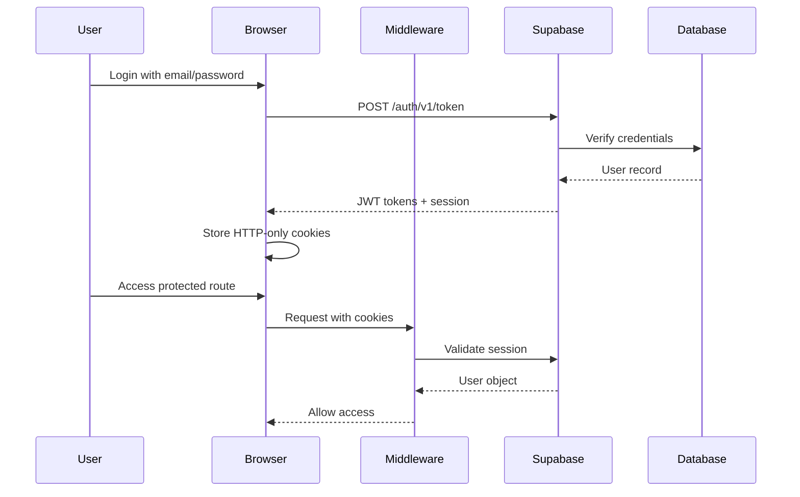
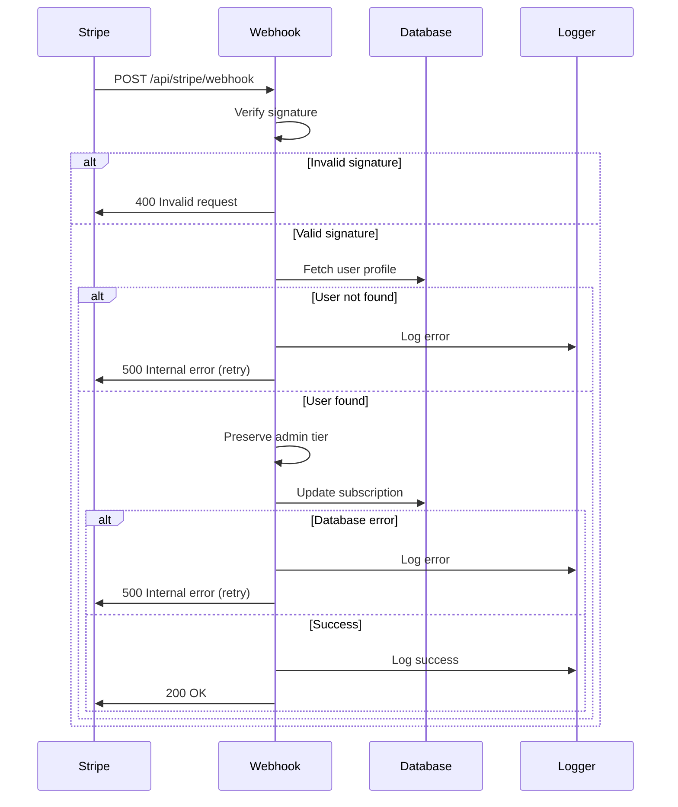

# Security Documentation

## Table of Contents
1. [Overview](#overview)
2. [Authentication & Authorization](#authentication--authorization)
3. [Data Protection](#data-protection)
4. [API Security](#api-security)
5. [Input Validation](#input-validation)
6. [Rate Limiting](#rate-limiting)
7. [Storage Security](#storage-security)
8. [Password Requirements](#password-requirements)
9. [Session Management](#session-management)
10. [Security Best Practices](#security-best-practices)
11. [Incident Response](#incident-response)
12. [Security Checklist](#security-checklist)

---

## Overview

This Next.js video editor application implements multiple layers of security to protect user data, prevent unauthorized access, and ensure secure API communications. Security is enforced at the authentication, authorization, transport, and data storage levels.

### Security Principles
- **Defense in Depth**: Multiple security layers
- **Least Privilege**: Users access only their own data
- **Zero Trust**: Verify every request
- **Secure by Default**: Encryption, HTTPS, secure cookies

---

## Authentication & Authorization

### Supabase Auth Integration

The application uses Supabase Auth for user authentication with the following features:

#### Authentication Methods
- **Email/Password**: Primary authentication method
- **OAuth Providers**: Ready for Google, GitHub integration
- **Anonymous Sign-in**: Available for demo purposes (rate-limited)
- **Magic Links**: Email-based passwordless login

#### Session Management
```typescript
// Session configuration
{
  accessTokenExpiresIn: 86400,      // 24 hours
  refreshTokenExpiresIn: 604800,    // 7 days
  sessionCookieOptions: {
    httpOnly: true,                  // Prevents XSS attacks
    secure: true,                    // HTTPS only in production
    sameSite: 'lax',                // CSRF protection
    path: '/'
  }
}
```

#### Authentication Flow


### Protected Routes

The following routes require authentication:
- `/editor/*` - Video editor and timeline
- `/projects` - Project management
- `/settings` - User settings
- `/api/*` - All API endpoints (except health checks)

```typescript
// middleware.ts enforces authentication
export async function middleware(request: NextRequest) {
  const { supabase } = createServerClient(request);
  const { data: { session } } = await supabase.auth.getSession();

  if (!session && isProtectedRoute(request.nextUrl.pathname)) {
    return NextResponse.redirect(new URL('/signin', request.url));
  }

  return NextResponse.next();
}
```

### Row-Level Security (RLS)

All database tables enforce Row-Level Security policies:

#### Projects Table RLS
```sql
-- Users can only SELECT their own projects
CREATE POLICY "projects_owner_select"
  ON projects FOR SELECT TO authenticated
  USING (auth.uid() = user_id);

-- Users can only INSERT projects with their user_id
CREATE POLICY "projects_owner_insert"
  ON projects FOR INSERT TO authenticated
  WITH CHECK (auth.uid() = user_id);

-- Users can only UPDATE their own projects
CREATE POLICY "projects_owner_update"
  ON projects FOR UPDATE TO authenticated
  USING (auth.uid() = user_id)
  WITH CHECK (auth.uid() = user_id);

-- Users can only DELETE their own projects
CREATE POLICY "projects_owner_delete"
  ON projects FOR DELETE TO authenticated
  USING (auth.uid() = user_id);
```

#### Assets Table RLS
```sql
-- Users can only access assets in their own projects
CREATE POLICY "assets_owner_select"
  ON assets FOR SELECT TO authenticated
  USING (
    EXISTS (
      SELECT 1 FROM projects p
      WHERE p.id = assets.project_id
        AND p.user_id = auth.uid()
    )
  );
```

### Service Role vs Authenticated Role

```typescript
// Authenticated client - RLS enforced
const supabase = createServerSupabaseClient();
// Can only access user's own data

// Service role client - Bypasses RLS (admin operations only)
const supabaseAdmin = createClient(url, SERVICE_ROLE_KEY);
// Use sparingly and only for server-side operations
```

---

## Data Protection

### Encryption in Transit
- **HTTPS Only**: All production traffic over TLS 1.2+
- **Secure Cookies**: `secure` flag enabled in production
- **API Calls**: All external API calls use HTTPS

### Encryption at Rest
- **Supabase Storage**: AES-256 encryption
- **Database**: PostgreSQL encrypted at rest
- **Credentials**: Environment variables only, never in code

### Signed URLs for Asset Access

Private assets use time-limited signed URLs:

```typescript
// Generate signed URL (1 hour expiry)
const { data, error } = await supabase.storage
  .from('assets')
  .createSignedUrl(filePath, 3600);

// Security checks before signing
if (!filePath.startsWith(`${userId}/`)) {
  throw new Error('Unauthorized: Asset does not belong to user');
}
```

**Signed URL Benefits:**
- Time-limited access (default: 1 hour)
- User ownership verification
- No direct public access to private files
- Automatic expiration

### Sensitive Data Handling

**Never Log:**
- Passwords or password hashes
- API keys or secrets
- Session tokens
- Private user data (emails in error logs)

**Environment Variables:**
```bash
# Required secrets
SUPABASE_SERVICE_ROLE_KEY=xxx     # Server-side only
GOOGLE_SERVICE_ACCOUNT={}         # Server-side only
FAL_API_KEY=xxx                   # Server-side only
ELEVENLABS_API_KEY=xxx            # Server-side only
GEMINI_API_KEY=xxx                # Server-side only

# Public variables (safe to expose)
NEXT_PUBLIC_SUPABASE_URL=xxx
NEXT_PUBLIC_SUPABASE_ANON_KEY=xxx
```

---

## API Security

### CSRF Protection

Next.js provides built-in CSRF protection for form submissions. Additional measures:

```typescript
// POST-only for state-changing operations
export async function POST(req: NextRequest) {
  // Verify origin header
  const origin = req.headers.get('origin');
  const host = req.headers.get('host');

  if (origin && !origin.includes(host)) {
    return NextResponse.json(
      { error: 'Invalid origin' },
      { status: 403 }
    );
  }

  // Continue processing...
}
```

### Input Validation

All API endpoints validate input parameters:

```typescript
// Example: Video generation endpoint
export async function POST(req: NextRequest) {
  const body = await req.json();
  const { prompt, projectId } = body;

  // Validate required fields
  if (!prompt || typeof prompt !== 'string') {
    return NextResponse.json(
      { error: 'Prompt is required' },
      { status: 400 }
    );
  }

  // Validate prompt length
  if (prompt.length > 1000) {
    return NextResponse.json(
      { error: 'Prompt too long (max 1000 characters)' },
      { status: 400 }
    );
  }

  // Verify user owns the project
  const { data: project } = await supabase
    .from('projects')
    .select('id')
    .eq('id', projectId)
    .eq('user_id', user.id)
    .single();

  if (!project) {
    return NextResponse.json(
      { error: 'Project not found or access denied' },
      { status: 403 }
    );
  }
}
```

### Path Traversal Prevention

```typescript
// Prevent path traversal in storage URLs
function parseStorageUrl(storageUrl: string) {
  const path = storageUrl.replace(/^supabase:\/\//, '');

  // Reject paths with traversal attempts
  if (path.includes('..') || path.includes('//')) {
    console.error('Path traversal attempt detected:', storageUrl);
    return null;
  }

  return path;
}
```

### File Upload Security

```typescript
// File upload validation
const ALLOWED_MIME_TYPES = {
  image: ['image/jpeg', 'image/png', 'image/gif', 'image/webp'],
  video: ['video/mp4', 'video/webm', 'video/quicktime'],
  audio: ['audio/mpeg', 'audio/wav', 'audio/ogg']
};

// Validate MIME type
if (!allowedTypes.includes(file.type)) {
  return NextResponse.json({
    error: 'Invalid file type',
    details: `Allowed types: ${allowedTypes.join(', ')}`
  }, { status: 400 });
}

// Validate file size (100MB max)
const MAX_FILE_SIZE = 100 * 1024 * 1024;
if (file.size > MAX_FILE_SIZE) {
  return NextResponse.json({
    error: 'File too large (max 100MB)'
  }, { status: 400 });
}

// Generate unique filename (prevent overwrites)
const fileName = `${crypto.randomUUID()}.${fileExt}`;
const filePath = `${user.id}/${projectId}/${fileName}`;
```

---

## Input Validation

### XSS Prevention

- **React**: Automatic escaping of user input in JSX
- **Sanitization**: No `dangerouslySetInnerHTML` used
- **Content-Type**: All API responses use `application/json`

### SQL Injection Prevention

- **Parameterized Queries**: Supabase client uses prepared statements
- **ORM**: No raw SQL from user input
- **Type Safety**: TypeScript enforces data types

```typescript
// Safe query (parameterized)
const { data } = await supabase
  .from('projects')
  .select('*')
  .eq('user_id', userId);  // Automatically escaped

// NEVER do this:
// const query = `SELECT * FROM projects WHERE user_id = '${userId}'`;
```

---

## Rate Limiting

### Rate Limit Configuration

```typescript
export const RATE_LIMITS = {
  // Expensive operations (video generation)
  expensive: { max: 5, windowMs: 60 * 1000 },    // 5 req/min

  // Strict (auth operations)
  strict: { max: 10, windowMs: 10 * 1000 },      // 10 req/10s

  // Moderate (general API)
  moderate: { max: 30, windowMs: 60 * 1000 },    // 30 req/min

  // Relaxed (read operations)
  relaxed: { max: 100, windowMs: 60 * 1000 }     // 100 req/min
};
```

### Endpoint-Specific Rate Limits

| Endpoint | Rate Limit | Identifier |
|----------|-----------|------------|
| POST /api/video/generate | 5/min | User ID |
| POST /api/auth/signin | 10/10s | IP address |
| POST /api/auth/signup | 10/10s | IP address |
| POST /api/assets/upload | 30/min | User ID |
| GET /api/assets | 100/min | User ID |
| POST /api/ai/chat | 30/min | User ID |

### Rate Limit Headers

```http
X-RateLimit-Limit: 5
X-RateLimit-Remaining: 4
X-RateLimit-Reset: 2025-01-23T12:34:56Z
Retry-After: 60
```

### DDoS Protection

- **Cloudflare/Vercel**: Edge-level DDoS protection
- **Connection Limits**: Supabase connection pooling
- **Timeout**: 30-second request timeout

---

## Storage Security

### Bucket Policies

#### Assets Bucket
```sql
-- Users can upload to their own folder
CREATE POLICY "Users can upload to own folder in assets"
  ON storage.objects FOR INSERT TO authenticated
  WITH CHECK (
    bucket_id = 'assets' AND
    (storage.foldername(name))[1] = auth.uid()::text
  );

-- Users can read their own files
CREATE POLICY "Users can read own files in assets"
  ON storage.objects FOR SELECT TO authenticated
  USING (
    bucket_id = 'assets' AND
    (storage.foldername(name))[1] = auth.uid()::text
  );

-- Service role has full access
CREATE POLICY "Service role has full access to assets"
  ON storage.objects FOR ALL TO service_role
  USING (bucket_id = 'assets')
  WITH CHECK (bucket_id = 'assets');
```

### File Size Limits

| Bucket | Max File Size | Allowed Types |
|--------|--------------|---------------|
| assets | 500 MB | video, audio, image |
| frames | 50 MB | image only |
| frame-edits | 100 MB | image only |

### Storage Path Structure

```
storage/
├── assets/
│   └── {user_id}/
│       └── {project_id}/
│           ├── video_123.mp4
│           ├── audio_456.mp3
│           └── image_789.jpg
├── frames/
│   └── {user_id}/
│       └── frame_001.jpg
└── frame-edits/
    └── {user_id}/
        └── edit_001.jpg
```

---

## Password Requirements

### Password Strength Requirements

Passwords must meet ALL of the following criteria:
- Minimum 8 characters
- At least one lowercase letter (a-z)
- At least one uppercase letter (A-Z)
- At least one number (0-9)
- At least one special character (!@#$%^&*...)

### Password Strength Validation

```typescript
export function validatePassword(password: string): string | null {
  if (password.length < 8) {
    return 'Password must be at least 8 characters long';
  }
  if (!/[a-z]/.test(password)) {
    return 'Password must contain at least one lowercase letter';
  }
  if (!/[A-Z]/.test(password)) {
    return 'Password must contain at least one uppercase letter';
  }
  if (!/[0-9]/.test(password)) {
    return 'Password must contain at least one number';
  }
  if (!/[^a-zA-Z0-9]/.test(password)) {
    return 'Password must contain at least one special character';
  }
  return null; // Valid
}
```

### Password Storage

- **Never Stored**: Passwords are never stored in plain text
- **Hashing**: Supabase uses bcrypt with salt
- **Reset Flow**: Token-based password reset (1-hour expiry)

---

## Session Management

### Session Configuration

```typescript
{
  accessToken: {
    expiresIn: 3600,              // 1 hour
    autoRefresh: true             // Auto-refresh before expiry
  },
  refreshToken: {
    expiresIn: 604800,            // 7 days
    reuseInterval: 10             // Allow reuse within 10s
  }
}
```

### Session Timeout

- **Active Session**: 24 hours
- **Idle Timeout**: 8 hours
- **Remember Me**: Not implemented (security best practice)

### Logout Security

```typescript
// Secure logout endpoint
export async function POST(req: NextRequest) {
  // Verify origin to prevent CSRF
  const origin = req.headers.get('origin');
  if (!origin || !isAllowedOrigin(origin)) {
    return NextResponse.json({ error: 'Invalid origin' }, { status: 403 });
  }

  // Sign out and clear session
  const supabase = await createServerSupabaseClient();
  await supabase.auth.signOut();

  // Clear cookies
  const response = NextResponse.json({ success: true });
  response.cookies.delete('sb-access-token');
  response.cookies.delete('sb-refresh-token');

  return response;
}
```

---

## Security Best Practices

### For Developers

1. **Never commit secrets** to Git
   - Use `.env.local` for local development
   - Use Vercel environment variables for production
   - Check `.gitignore` includes `.env*`

2. **Validate all user input**
   - Check data types
   - Validate ranges and lengths
   - Sanitize special characters

3. **Use TypeScript strict mode**
   - Catch type errors at compile time
   - Prevent `any` types
   - Enable `strictNullChecks`

4. **Minimize client-side secrets**
   - Only `NEXT_PUBLIC_*` variables exposed to client
   - Keep API keys server-side only

5. **Implement proper error handling**
   - Never expose stack traces to users
   - Log errors server-side only
   - Return generic error messages

### For Users

1. **Use strong passwords** (see requirements above)
2. **Enable 2FA** (when available)
3. **Log out on shared computers**
4. **Report suspicious activity**
5. **Keep browser updated**

### Deployment Security

```bash
# Production environment variables
NEXT_PUBLIC_SUPABASE_URL=https://xxx.supabase.co
NEXT_PUBLIC_SUPABASE_ANON_KEY=xxx
SUPABASE_SERVICE_ROLE_KEY=xxx          # Secret
GOOGLE_SERVICE_ACCOUNT={"type":"..."}  # Secret
FAL_API_KEY=xxx                        # Secret
ELEVENLABS_API_KEY=xxx                 # Secret
GEMINI_API_KEY=xxx                     # Secret
AXIOM_TOKEN=xxx                        # Secret
```

**Vercel Deployment:**
1. Set environment variables in Vercel dashboard
2. Mark sensitive variables as "Secret"
3. Use different keys for preview/production
4. Rotate keys every 90 days

---

## Stripe Webhook Configuration

### Overview

Stripe webhooks are critical for handling subscription events and payment confirmations. They must be properly configured with webhook signing secrets to prevent unauthorized access and ensure secure processing.

### Security Requirements

**CRITICAL**: The `STRIPE_WEBHOOK_SECRET` environment variable is **required** for webhook security:
- Validates webhook requests are from Stripe
- Prevents replay attacks
- Ensures event authenticity
- **Webhooks will fail with 503 error if not configured**

### Local Development Setup

1. **Install Stripe CLI**
   ```bash
   # macOS
   brew install stripe/stripe-cli/stripe

   # Other platforms: https://stripe.com/docs/stripe-cli
   ```

2. **Authenticate with Stripe**
   ```bash
   stripe login
   ```

3. **Forward webhooks to local server**
   ```bash
   stripe listen --forward-to localhost:3000/api/stripe/webhook
   ```

4. **Copy the webhook signing secret**
   - The CLI will display a webhook signing secret (starts with `whsec_`)
   - Add it to your `.env.local`:
   ```bash
   STRIPE_WEBHOOK_SECRET=whsec_your_local_webhook_secret_here
   ```

### Production Setup

1. **Create webhook endpoint in Stripe Dashboard**
   - Go to: https://dashboard.stripe.com/webhooks
   - Click "Add endpoint"
   - Set URL: `https://your-domain.com/api/stripe/webhook`

2. **Select webhook events**
   Required events:
   - `checkout.session.completed` - Payment successful
   - `customer.subscription.updated` - Subscription changed
   - `customer.subscription.deleted` - Subscription canceled

3. **Copy the webhook signing secret**
   - After creating the endpoint, click to reveal the signing secret
   - Add it to your production environment variables:
   ```bash
   STRIPE_WEBHOOK_SECRET=whsec_your_production_webhook_secret_here
   ```

### Webhook Security Features

#### 1. Signature Verification
```typescript
// All webhooks verify Stripe signature
const event = stripe.webhooks.constructEvent(
  body,
  signature,
  process.env.STRIPE_WEBHOOK_SECRET
);
```

#### 2. Error Handling with Retry
- Database errors return 500 status to trigger Stripe retry
- Invalid requests return 400 (no retry)
- Service errors return 503 (Stripe will retry)

#### 3. User Validation
- Validates userId exists in webhook metadata
- Verifies user profile exists before updates
- Prevents orphaned subscription updates

#### 4. Admin Tier Preservation
- Never downgrades admin users to premium or free
- Preserves admin tier through checkout and cancellation
- Logs all tier transitions for audit trail

#### 5. Secure Error Messages
- Generic errors to external clients ("Service temporarily unavailable")
- Detailed errors logged server-side only
- No configuration state revealed to attackers

### Webhook Event Flow



### Testing Webhooks

#### Local Testing
```bash
# Terminal 1: Start your dev server
npm run dev

# Terminal 2: Forward Stripe webhooks
stripe listen --forward-to localhost:3000/api/stripe/webhook

# Terminal 3: Trigger test events
stripe trigger checkout.session.completed
stripe trigger customer.subscription.updated
stripe trigger customer.subscription.deleted
```

#### Production Testing
1. Use Stripe test mode with test cards
2. Monitor webhook logs in Stripe Dashboard
3. Check Axiom logs for detailed event processing
4. Verify database updates in Supabase

### Monitoring & Logging

All webhook events are logged to Axiom with structured logging:

```typescript
// Successful checkout
{
  event: 'stripe.checkout.completed',
  userId: 'user-id',
  subscriptionId: 'sub_xxx',
  oldTier: 'free',
  newTier: 'premium',
  amount: 999,
  currency: 'usd'
}

// Database error (triggers retry)
{
  event: 'stripe.checkout.db_error',
  userId: 'user-id',
  error: 'Database update failed',
  code: 'PGRST116'
}
```

### Troubleshooting

#### Webhook returns 503
- **Cause**: `STRIPE_WEBHOOK_SECRET` not configured
- **Fix**: Add webhook secret to environment variables
- **Log**: "CRITICAL: STRIPE_WEBHOOK_SECRET is not set"

#### Webhook returns 400
- **Cause**: Invalid signature or missing signature header
- **Fix**: Verify webhook secret matches Stripe dashboard
- **Log**: "Webhook signature verification failed"

#### Webhook returns 500
- **Cause**: Database error or missing user profile
- **Fix**: Check Axiom logs for specific error
- **Note**: Stripe will automatically retry

#### Admin user downgraded to premium
- **Cause**: Old webhook code didn't preserve admin tier
- **Fix**: Update to latest webhook handler (includes admin preservation)
- **Prevention**: All tier updates now check current tier first

### Security Checklist

- [ ] `STRIPE_WEBHOOK_SECRET` configured in all environments
- [ ] Webhook endpoint uses HTTPS in production
- [ ] Webhook events limited to required events only
- [ ] Database errors return 500 to trigger retry
- [ ] Admin tier preservation tested
- [ ] Error logs monitored in Axiom
- [ ] Webhook signature verification tested
- [ ] No sensitive data in error responses

---

## Incident Response

### Security Incident Classification

**Critical**: Data breach, account takeover, service outage
**High**: SQL injection attempt, XSS vulnerability, unauthorized access
**Medium**: Rate limit bypass, suspicious login attempts
**Low**: Failed login attempts, invalid input

### Incident Response Process

1. **Detection**
   - Monitor Axiom logs for suspicious activity
   - Check Supabase auth logs
   - Review error rates in API

2. **Containment**
   - Revoke compromised API keys
   - Block suspicious IP addresses
   - Disable affected user accounts (if needed)

3. **Investigation**
   - Review access logs
   - Check database audit logs
   - Identify attack vector

4. **Remediation**
   - Patch vulnerability
   - Reset affected user passwords
   - Rotate API keys

5. **Post-Incident**
   - Document incident
   - Update security policies
   - Improve monitoring

### Contact

**Security Issues**: Report to `security@example.com`
**Response Time**: 24 hours for critical issues

---

## Security Checklist

### Pre-Deployment

- [ ] All environment variables configured
- [ ] RLS policies tested and verified
- [ ] Rate limiting enabled on all endpoints
- [ ] HTTPS enforced in production
- [ ] Secure cookies enabled (`httpOnly`, `secure`, `sameSite`)
- [ ] CORS configured correctly
- [ ] File upload validation in place
- [ ] Error messages don't expose sensitive data
- [ ] No secrets committed to Git
- [ ] Dependencies updated (no known vulnerabilities)

### Post-Deployment

- [ ] Monitor Axiom logs for errors
- [ ] Check failed authentication attempts
- [ ] Review rate limit violations
- [ ] Verify RLS policies active
- [ ] Test password reset flow
- [ ] Verify signed URLs expire correctly
- [ ] Check storage bucket policies
- [ ] Monitor API response times

### Monthly Maintenance

- [ ] Review and rotate API keys
- [ ] Update dependencies (`npm audit`)
- [ ] Check Supabase logs for anomalies
- [ ] Review user access patterns
- [ ] Audit RLS policies
- [ ] Test backup restoration

---

## Security Audit Log

| Date | Change | Impact |
|------|--------|--------|
| 2025-01-23 | Added processing_jobs RLS policies | Protected async job data |
| 2025-01-22 | Fixed projects RLS INSERT policy | Allowed project creation |
| 2025-01-01 | Initial schema with RLS | Baseline security |

---

## Additional Resources

- [OWASP Top 10](https://owasp.org/www-project-top-ten/)
- [Supabase Security Best Practices](https://supabase.com/docs/guides/auth/security)
- [Next.js Security Headers](https://nextjs.org/docs/advanced-features/security-headers)
- [NIST Password Guidelines](https://pages.nist.gov/800-63-3/sp800-63b.html)

---

**Last Updated**: 2025-01-23
**Version**: 1.0.0
**Security Officer**: Development Team
